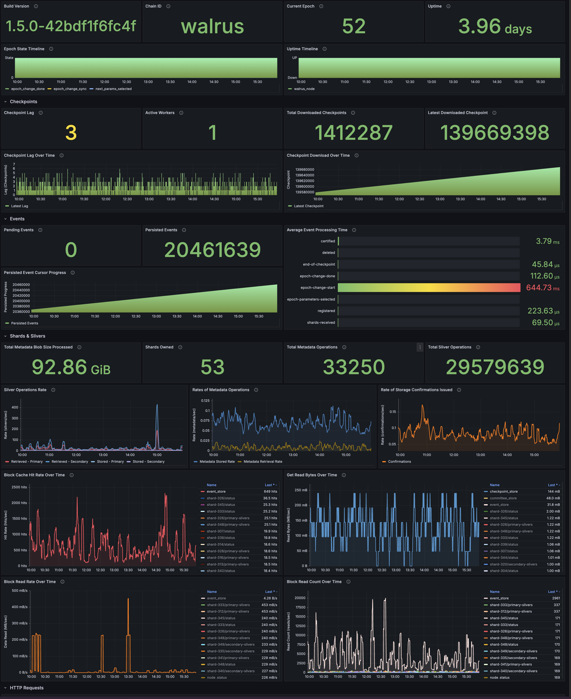
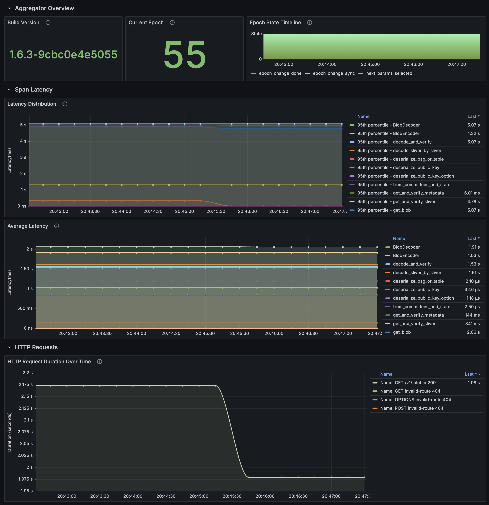
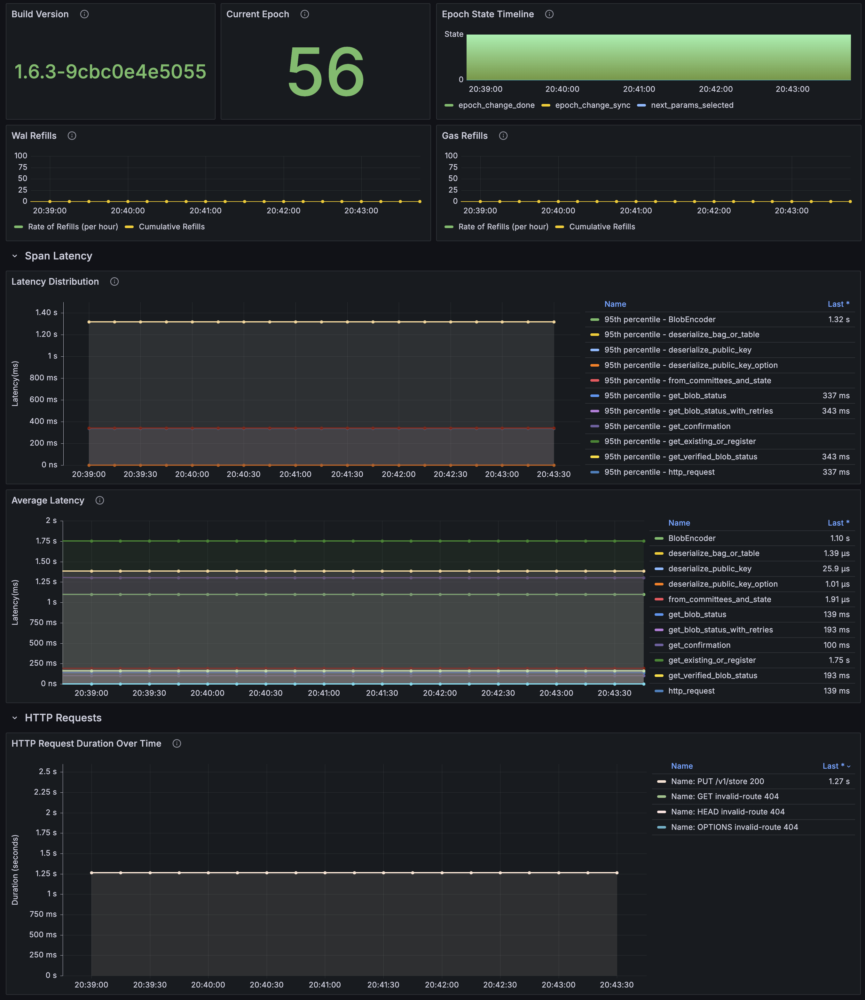

# Walrus Tools

This repository contains configurations and tools for monitoring and managing the Walrus network. It currently includes setup files for Grafana and Prometheus, along with pre-configured dashboards for monitoring the Walrus Storage Node, Aggregator, and Publisher services.

---

## Setup and Deployment

### 1. Clone the Repository

```bash
git clone https://github.com/walrus-network/walrus-tools.git
```

### 2. Navigate to the directory

```bash
cd walrus-tools
```

### 3. Set Environment Variables

```bash
cp .env.tmp .env
```

Edit the `.env` file as needed to configure Grafana and Prometheus. Example `.env.tmp`:

```plaintext
# Grafana Configuration
GF_SECURITY_ADMIN_USER=<admin_user>
GF_SECURITY_ADMIN_PASSWORD=<admin_password>
GF_PORT=3000

# Prometheus Configuration
PROMETHEUS_PORT=9090
PROMETHEUS_TARGET=localhost:9090

# Walrus Targets
WALRUS_NODE_TARGET=localhost:9184
WALRUS_AGGREGATOR_TARGET=localhost:27182
WALRUS_PUBLISHER_TARGET=localhost:27183

# Walrus Node URL
WALRUS_NODE_URL=https://localhost:9185
```

### 4. Start the Services

```bash
docker compose up -d
```

This will deploy Grafana and Prometheus containers. Grafana will be accessible at `http://localhost:3000`, and Prometheus at `http://localhost:9090` (or the ports specified in the `.env` file).

### 5. Deploy Specific Dashboards

If you wish to deploy only a subset of the dashboards (e.g., only the Storage Node dashboard), comment out or remove the respective target variables from the `.env` file. For example:

To deploy only the Storage Node dashboard:

```plaintext
# Walrus Targets
WALRUS_NODE_TARGET=localhost:9184
# WALRUS_AGGREGATOR_TARGET=localhost:27182
# WALRUS_PUBLISHER_TARGET=localhost:27183
```

Restart the Prometheus container to apply the updated configuration:

```bash
docker compose restart prometheus
```

### 6. Access the Pre-Configured Dashboards

Log in to Grafana with the credentials set in your `.env` file.
The dashboards will be automatically provisioned and available in the Grafana UI.

## Currently Supported Dashboards

- **Walrus Storage Node Dashboard**
  - **Description**: This dashboard provides insights into the performance and status of the Walrus Storage Node, including metrics such as storage usage, retrieval rates, and operation latency.
  - **Dashboard File**: [walrus_storage_node.json](./grafana/dashboards/walrus_storage_node.json)

  

- **Walrus Aggregator Dashboard**
  - **Description**: This dashboard visualizes metrics for the Aggregator service, including blob reconstruction rates, HTTP request handling, and operational health.
  - **Dashboard File**: [walrus_aggregator.json](./grafana/dashboards/walrus_aggregator.json)

  

- **Walrus Publisher Dashboard**
  - **Description**: This dashboard monitors the Publisher service, providing metrics such as blob storage operations, write latency, and error rates.
  - **Dashboard File**: [walrus_publisher.json](./grafana/dashboards/walrus_publisher.json)

  

## Dynamic Configuration Management

### Prometheus Configuration

The `entrypoint.sh` script dynamically generates the Prometheus scrape configuration file (`prometheus.yml`) based on environment variables. Users do not need to modify the script directly. Configuration is fully driven by the following environment variables:

- **`PROMETHEUS_TARGET`**: Specifies the target for the Prometheus service.
- **`WALRUS_NODE_TARGET`**: Specifies the target for the Walrus Storage Node.
- **`WALRUS_AGGREGATOR_TARGET`**: Specifies the target for the Walrus Aggregator service.
- **`WALRUS_PUBLISHER_TARGET`**: Specifies the target for the Walrus Publisher service.
- **`WALRUS_NODE_URL`**: Specifies the URL for the Walrus Node.

### Example Configuration in `.env` File

```plaintext
# Grafana Configuration
GF_SECURITY_ADMIN_USER=admin
GF_SECURITY_ADMIN_PASSWORD=admin
GF_PORT=3000

# Prometheus Configuration
PROMETHEUS_PORT=9090
PROMETHEUS_TARGET=localhost:9090

# Walrus Targets
WALRUS_NODE_TARGET=localhost:9184
WALRUS_AGGREGATOR_TARGET=localhost:27182
WALRUS_PUBLISHER_TARGET=localhost:27183

# Walrus Node URL
WALRUS_NODE_URL=https://localhost:9185
```

### Modifying Targets

To modify scrape targets, update the `.env` file with the new target values. For example:

```plaintext
WALRUS_NODE_TARGET=<new_walrus_node_target>
WALRUS_AGGREGATOR_TARGET=<new_walrus_aggregator_target>
WALRUS_PUBLISHER_TARGET=<new_walrus_publisher_target>
```

### Modifying Walrus Node URL

To modify the Walrus Node URL, update the `.env` file with the new URL. For example:

```plaintext
WALRUS_NODE_URL=<new_walrus_node_url>
```

Restart the Prometheus container to apply changes:

```bash
docker compose restart prometheus
```

## Contributing

Feel free to contribute enhancements or additional tools for the Walrus network. Submit pull requests or issues to this repository.

## License

This repository is licensed under the MIT License. See the LICENSE file for details.

